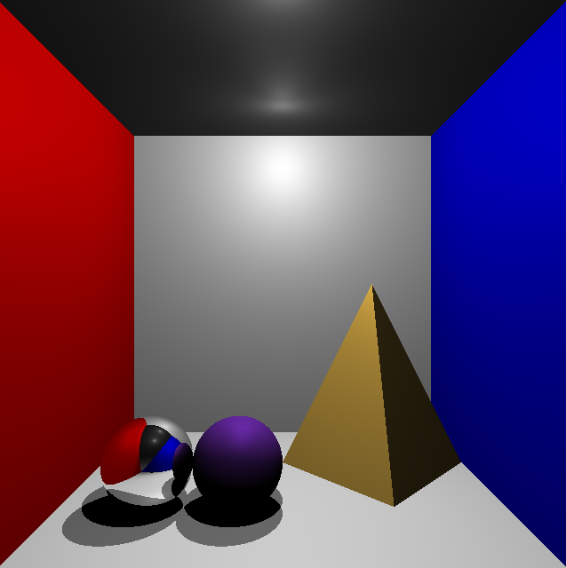

# Raytracer

Given the defined co-ordinates and colours of 3D shapes such as a Triangle, Sphere, Rectangle, and a light source in an xml file. This will produce the created scene based on the intersection of rays to a camera placed on the origin. 



## Creating the scene

A scene is defined through an xml file (currently hardcoded as models/model.xml). The entire scene encompassed by the:

`<scene>...</scene>`

### Lights
Within the scope of the `<lights>...</lights>` element. 
These lights are not directed, light is emitted in every direction. So all that needs specification is its position and color.
```xml
<light>
	<position x="0" y="9" z="-15.0"/>
	<color r="1.0" g="1.0" b="1.0"/>
</light>
```

### Objects
Keeping things consistent, objects are of course defined within the `<objects>...</objects>` element.

#### Plane
Planes unlike the other objects do not require specific limits to their size, and if a rectangle is the desired object of choice, this is represented by two triangles. With this in mind, the plane is only represented by its color, a point in 3d space, and a normal, for the direction it is facing.
```xml
<planes>
    <plane>
        <point x="0.0" y="-10.0" z="0.0"/>
        <normal x="0.0" y="10.0" z="0.0"/>
        <color r="1.0" g="1.0" b="1.0" />
        <specs ref="0" diff="0.8" ambi="1" spec="0.2"/>
    </plane>
</planes>
```
Another aspect introduced in objects is the specs, which is the texture of the object. `ref` is the Reflection. `diff` is the diffused light effect on the surface, creating shadows in the absence of light on the surface. `spec` is the specular light effect.
#### Triangles
Requires the 3 points, a colour and the specs. The normal is determined from the 3 points and is represented both ways. 
```xml
<triangles>
    <triangle>
        <point x="5" y="0" z="-25.0"/>
        <point x="0" y="-10.0" z="-25.0"/>
        <point x="10" y="-10" z="-25.0"/>
        <color r="0.94" g="0.75" b="0.31"/>
        <specs ref="0" diff="1" ambi="1" spec="1"/>
    </triangle>
</triangles>
```

#### Spheres
Simple in representation because all that's needed is its center point and the radius. This determines the normals, as well as the intersections for any rays towards the sphere. Along with this is the color and lighting specs.
```xml
<spheres>
    <sphere radius="2.0">
        <center x="-6.0" y="-8.0" z="-20.0"/>
        <color r="0.0" g="0.0" b="0.0" />
        <specs ref="1" diff="0.8" ambi="1" spec="0.2"/>
    </sphere>
</spheres>
```

